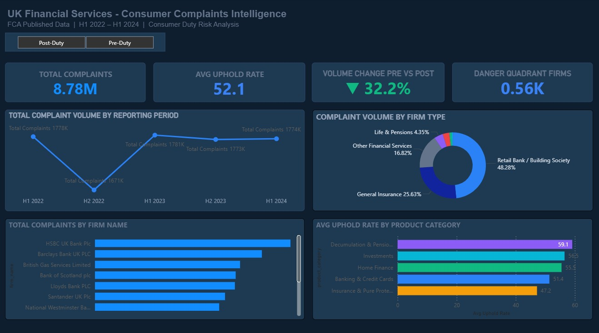
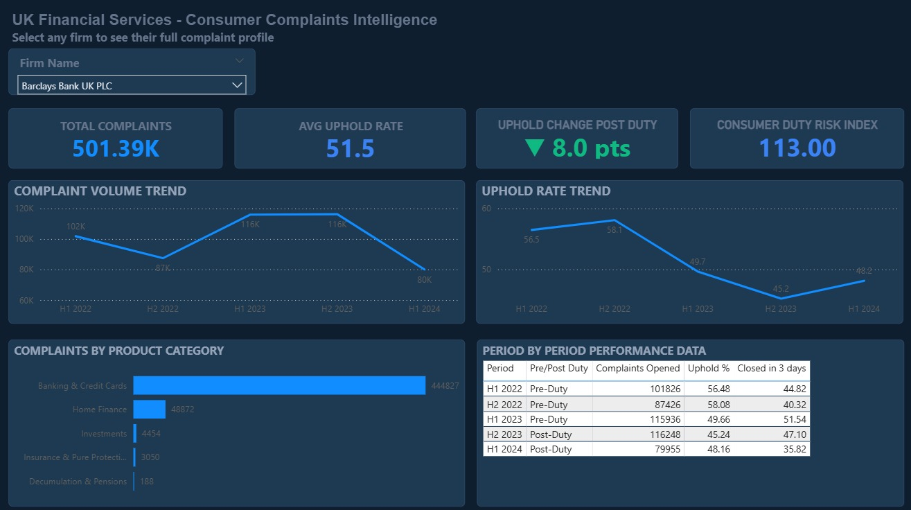
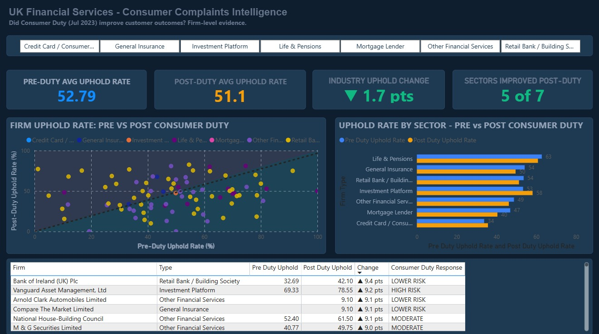

# UK Financial Services Consumer Complaints Intelligence
### A Consumer Duty Risk Analysis — FCA Published Data 2022–2024



---

## The Question This Project Answers

The FCA's Consumer Duty regulation came into force on **31 July 2023**, requiring UK financial services firms to demonstrate good outcomes for retail customers. Complaints data is the primary publicly available signal of whether firms are actually meeting this requirement.

**Did Consumer Duty work? And which firms should regulators look at first?**

This project analyses 5 consecutive periods of FCA-published firm-level complaints data to answer that question — across **283 regulated firms**, **6.99 million complaints**, and **5 product categories**.

---

## Key Findings

| Finding | Detail |
|---------|--------|
| Consumer Duty broadly worked at sector level | 5 of 7 firm types showed improved uphold rates post-July 2023 |
| Two sectors got worse, not better | General Insurance and Life & Pensions uphold rates increased post-Duty |
| 17 firms in the Danger Quadrant | Both above-average complaint volume AND above-average uphold rate simultaneously |
| NatWest Group has two subsidiaries in the Danger Quadrant | National Westminster Bank Plc and The Royal Bank of Scotland Plc both flagged |
| British Gas ranks in the top 3 on the Risk Index | A non-financial firm performing worse than most regulated banks on complaint handling |
| Industry uphold rate increased slightly post-Duty | Average moved from 51.8% (Pre-Duty) to 53.1% (Post-Duty) — driven by insurance and pensions |

---

## Dashboard

The interactive Power BI dashboard has three pages:

**Page 1 — Executive Overview**
KPI tiles, complaint volume trend with Consumer Duty marker, top 12 firms by volume, sector donut chart, and uphold rate by product category.


**Page 2 — Firm Intelligence**
Select any of the 283 firms from a dropdown and all visuals update instantly — complaint trajectory, uphold rate trend, product category breakdown, and period-by-period data table.



**Page 3 — Consumer Duty Analysis**
The centrepiece scatter chart plots every firm's pre-Duty vs post-Duty uphold rate. Firms above the diagonal line got worse. Firms below it improved. Sector comparison bars and a worsened firms table complete the page.



---

## Project Structure

```
fca-complaints-intelligence/
│
├── README.md
│
├── data/
│   └── processed/
│       ├── fca_complaints_master.csv      ← Main analysis dataset (1,638 rows)
│       ├── fca_complaints_master.xlsx     ← 4-sheet workbook for Power BI
│       └── sql_outputs/                   ← 12 query result CSVs
│
├── scripts/
│   ├── 01_data_cleaning.py                ← Data pipeline (5 FCA files → master CSV)
│   └── 02_sql_analysis.py                 ← 12 SQL queries via SQLite
│
├── notebooks/
│   └── 03_eda_notebook.ipynb              ← 10 analytical charts with interpretations
│
├── deliverables/
│   └── FCA_Consumer_Duty_Briefing_Note.docx  ← 1-page executive briefing
│
└── assets/
    ├── dashboard_overview.png
    ├── dashboard_firm_intelligence.png
    ├── dashboard_consumer_duty.png
    └── dashboard_scatter_hero.png
```

---

## Data Source

All data is publicly available from the FCA website:
**[fca.org.uk/data/complaints-data](https://www.fca.org.uk/data/complaints-data)**

Files used:
- firm-level-complaints-data-2022-h1.xlsx
- firm-level-complaints-data-2022-h2.xlsx
- firm-level-complaints-data-2023-h1.xlsx
- firm-level-complaints-data-2023-h2.xlsx
- firm-level-complaints-data-2024-h1.xlsx

The FCA publishes this data every six months. It covers all regulated firms that received 500 or more reportable complaints in a reporting period.

---

## Methodology

### Data Cleaning (`01_data_cleaning.py`)
- Read 5 Excel files with inconsistent sheet names and column formats across years
- Melted wide format (one column per product category) into long format (one row per firm × category × period)
- Standardised product category names across years
- Classified 283 firms into 7 firm types using keyword matching on firm names
- Added Pre/Post Consumer Duty flag (Duty came into force 31 July 2023)
- Calculated period-on-period complaint change and uphold rate change
- Output: 1,638 rows × 29 columns

### SQL Analysis (`02_sql_analysis.py`)
- Loaded master CSV into SQLite for relational querying
- 12 queries across 4 modules:
  - **Module A** — Volume and trend analysis (LAG window functions for period-on-period)
  - **Module B** — Product category performance pre vs post Consumer Duty
  - **Module C** — Uphold rate analysis including the Danger Quadrant (NTILE quartile banding)
  - **Module D** — Resolution speed analysis (% closed within 3 days)

### Exploratory Data Analysis (`03_eda_notebook.ipynb`)
- 10 charts covering industry trends, uphold rate distributions, the Danger Quadrant scatter chart, and Consumer Duty before/after comparisons
- Each chart includes an analytical interpretation in plain English

### Consumer Duty Risk Index
A composite score per firm weighted across four dimensions:
- Complaint volume (30%)
- Average uphold rate (35%)
- Uphold rate trend — improving or worsening (20%)
- Volume growth rate (15%)

Scores normalised to 0–100 using min-max scaling. Firms with fewer than 1,000 total complaints excluded.

### Power BI Dashboard
- 3-page interactive dashboard
- Single flat table (All Data) as the fact table
- 12 DAX measures including arrow label formatting for directional changes
- Symmetry shading on the scatter chart divides firms that improved from those that worsened

---

## How to Run the Code

**Requirements:**
```
pip install pandas numpy matplotlib seaborn openpyxl scikit-learn
```

**Steps:**
1. Download the 5 FCA Excel files from the link above into the project folder
2. Run the cleaning script: `python scripts/01_data_cleaning.py`
3. Run the SQL analysis: `python scripts/02_sql_analysis.py`
4. Open the EDA notebook: `notebooks/03_eda_notebook.ipynb`
5. Load `data/processed/fca_complaints_master.xlsx` into Power BI Desktop

---

## Skills Demonstrated

| Skill | Where Used |
|-------|-----------|
| Python (pandas, numpy) | Data cleaning pipeline, EDA notebook |
| SQL (SQLite, window functions) | 12 analytical queries including LAG, RANK, NTILE |
| Power BI (DAX, data modelling) | 3-page interactive dashboard |
| Data storytelling | Briefing note, chart interpretations, README |
| Regulatory domain knowledge | Consumer Duty context, FCA data interpretation |
| Business analysis | Translating data findings into business recommendations |

---

## Limitations

- FCA data only covers firms above the 500-complaint threshold — smaller firms are not included
- Uphold rate is calculated on closed complaints and may not reflect unresolved cases
- Complaint volumes reflect firm size as well as performance — large banks will always appear in high-volume rankings
- Redress amounts are not published at firm level and are not included in this analysis

---

## About This Project

This project was built as a portfolio piece targeting Business Analyst and Data Analyst roles in UK financial services, consulting, and risk functions. It uses real publicly available regulatory data and applies genuine analytical techniques to produce findings that are directly relevant to compliance teams, risk functions, and regulatory affairs professionals at UK banks and insurers.

**Author:** Prajwal Lawankar
**Background:** MSc Engineering Management (University of York) | 2 years TCS consulting (BFSI + Media) | Skills: Python, SQL, Power BI, Excel, BA methodology

**Contact:** https://www.linkedin.com/in/prajwal-lawankar/ | prajwallawankar@gmail.com
